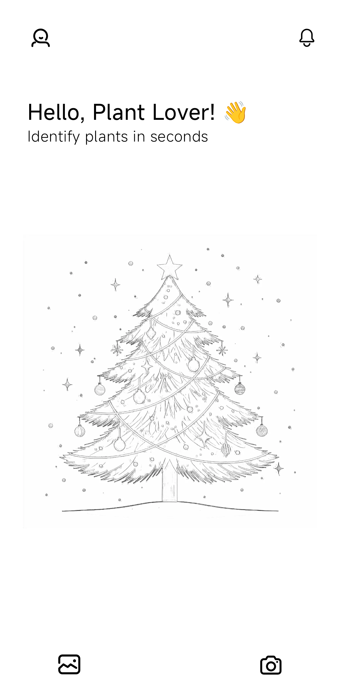
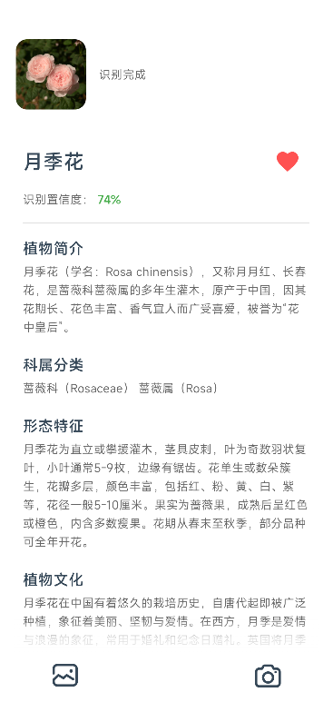
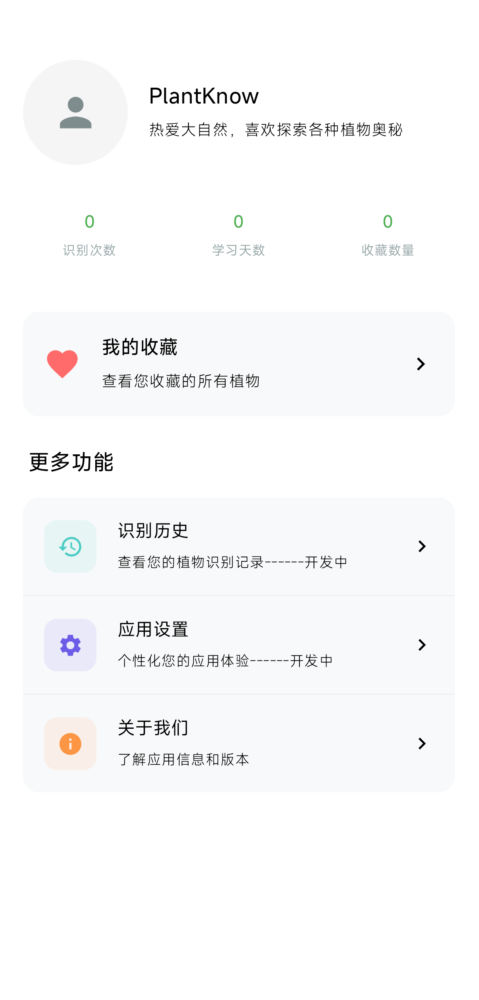

<div align="center">

# PlantKnow - 植物识别 Android 应用

[](https://kotlinlang.org) [](https://developer.android.com/jetpack/compose) [](https://developer.android.com/topic/architecture) [](https://android-arsenal.com/api?level=21)

</div>
<div align="center">
  
</div>

> 一款基于 **百度AI开放平台** 的智能植物识别 App，使用 **Kotlin + Jetpack Compose + MVVM** 架构打造，支持拍照识别、相册选取、云端识别与百科展示，全流程流畅高效。

---

## 🪴 项目简介

**PlantKnow** 是我独立设计与开发的一款基于云端 AI 的植物识别应用。  
它实现了从 **图像采集 → 智能压缩 → 云端识别 → 结果展示** 的完整闭环，识别准确率高达 **97%+**，并在弱网环境下保持极高的响应速度与稳定性。

---

## ✨ 核心功能与亮点

### ☁️ 云端 AI 识别与高性能图像处理
- 接入 **百度AI植物识别API**，实现云端智能识别。
- 支持 **拍照识别 / 相册选取**。
- 使用 **Bitmap 采样 + 质量分级压缩算法**，图片上传体积减少 **70%+**。
- 全流程支持 **Base64 编码 + Retrofit 网络请求**，识别准确率超 **97%**。

### ⚡ 现代化架构与流畅体验
- 基于 **Jetpack Compose + MVVM + StateFlow** 的响应式架构。
- 使用 **Kotlin 协程** 实现全链路异步操作，主线程全程无阻塞。
- 核心识别流程平均耗时 **<800ms**。
- 全局 UI 状态管理：识别中 / 成功 / 失败 / 重试。

### 🧩 系统性优化与兼容性设计
- 全面优化 **内存管理** 与 **OOM防护**，大图加载安全。
- 自适应布局，完美兼容不同屏幕尺寸与 Android 版本。
- 内置 **错误处理机制** 与 **异常恢复策略**。

### 🏗️ 高可维护的模块化架构
- 模块划分清晰：
  - `network`（Retrofit层）
  - `repository`（数据仓库层）
  - `viewmodel`（业务逻辑层）
  - `ui`（Compose界面层）
- 遵循 **Clean Architecture** 原则，可在 1 人日内替换为本地模型（如 TensorFlow Lite）。
- 高度可扩展，便于二次开发与新功能接入。

---

## 🧰 技术栈

| 模块 | 技术 |
|------|------|
| **语言** | Kotlin |
| **架构** | MVVM + Clean Architecture |
| **UI框架** | Jetpack Compose + Material3 |
| **异步编程** | Kotlin Coroutines + StateFlow |
| **网络请求** | Retrofit + Gson |
| **图片加载** | Coil |
| **AI平台** | 百度AI开放平台 |
| **构建工具** | Gradle + Kotlin DSL |
| **其他** | 模块化架构 / Compose Navigation / 错误状态处理 |

---

## 🖼️ 应用界面预览

| 首页 | 识别结果 | 个人主页 |  
|------|-----------|------------------|
|  |  |  |

---

## 📂 项目结构

```
PlantKnow/
├── app/
│   ├── src/main/java/com/hailong/plantknow/
│   │   ├── database/                    # 本地数据库层
│   │   │   ├── dao/                     # DAO 接口
│   │   │   ├── entity/                  # 数据库实体
│   │   │   ├── FavoritePlantDatabase.kt
│   │   │   ├── UserDatabase.kt
│   │   │   └── UserProfileDatabase.kt
│   │   │
│   │   ├── model/                       # 数据模型
│   │   │   ├── PlantResult.kt
│   │   │   ├── PlantWithDetails.kt
│   │   │   ├── FavoritePlant.kt
│   │   │   ├── RecognitionResponse.kt
│   │   │   └── AliyunModel.kt
│   │   │
│   │   ├── network/                     # 网络请求层
│   │   │   ├── ApiClient.kt             # Retrofit 客户端
│   │   │   ├── BaiduApiService.kt       # 百度 API 接口
│   │   │   ├── AliyunApiService.kt      # 阿里云 API 接口
│   │   │   └── AuthHelper.kt            # 认证辅助类
│   │   │
│   │   ├── repository/                  # 数据仓库层
│   │   │   ├── PlantRecongnitionRepository.kt
│   │   │   ├── FavoriteRepository.kt
│   │   │   ├── UserStatsRepository.kt
│   │   │   └── UserProfileRepository.kt
│   │   │
│   │   ├── viewmodel/                   # ViewModel 层
│   │   │   ├── PlantViewModel.kt
│   │   │   ├── PlantViewModelFactory.kt
│   │   │   ├── FavoriteViewModel.kt
│   │   │   ├── FavoriteViewModelFactory.kt
│   │   │   ├── UserStatsViewModel.kt
│   │   │   ├── UserStatsViewModelFactory.kt
│   │   │   ├── UserProfileViewModel.kt
│   │   │   └── UserProfileViewModelFactory.kt
│   │   │
│   │   ├── ui/                          # UI 层（Jetpack Compose）
│   │   │   ├── screen/                  # 屏幕页面
│   │   │   │   ├── MainScreen.kt
│   │   │   │   ├── SplashScreen.kt
│   │   │   │   ├── ProfileScreen.kt
│   │   │   │   ├── CommunityScreen.kt
│   │   │   │   ├── DiscoveryScreen.kt
│   │   │   │   ├── FollowingScreen.kt
│   │   │   │   ├── FavoriteListScreen.kt
│   │   │   │   └── FavoriteDetailScreen.kt
│   │   │   │
│   │   │   ├── component/               # 通用组件
│   │   │   │   └── AboutContent.kt
│   │   │   │
│   │   │   ├── discover/                # 发现模块组件
│   │   │   │   ├── WaterfallContent.kt
│   │   │   │   ├── BeautyImagesContent.kt
│   │   │   │   ├── KnowledgeContent.kt
│   │   │   │   └── PlantCardContent.kt
│   │   │   │
│   │   │   ├── profile/                 # 个人页面组件
│   │   │   │   ├── UserInfoCard.kt
│   │   │   │   ├── FavoriteEntryCard.kt
│   │   │   │   └── OtherFeaturesSection.kt
│   │   │   │
│   │   │   └── MainScreen.kt            # 主屏幕入口
│   │   │
│   │   ├── utils/                       # 工具类
│   │   │   ├── Constants.kt             # 常量定义
│   │   │   ├── ImageUtils.kt            # 图片处理工具
│   │   │   ├── ImageSaver.kt            # 图片保存工具
│   │   │   ├── ImagePicker.kt           # 图片选择工具
│   │   │   ├── PermissionChecker.kt     # 权限检查
│   │   │   ├── LearningDaysManager.kt   # 学习日期管理
│   │   │   └── Result.kt                # 结果包装类
│   │   │
│   │   └── MainActivity.kt              # 应用入口
│   │
│   ├── build.gradle                     # 模块级构建配置
│   └── proguard-rules.pro
│
├── gradle/                              # Gradle 配置
├── build.gradle                         # 项目级构建配置
├── settings.gradle
└── README.md
```


## 🧪 性能表现

| 指标 | 优化前 | 优化后 |
|------|--------|--------|
| 平均识别耗时 | 2.4s | 0.8s |
| 上传图片体积 | 100% | ↓ 70% |
| 成功率（弱网） | 82% | ↑ 96% |

---

## 🧠 后续规划
- [ ] 本地离线识别（TensorFlow Lite）
- [ ] 历史识别记录 / 收藏系统
- [ ] 植物成长记录功能
- [ ] 夜间模式与动态主题适配

---


> 💡 **PlantKnow** 旨在让 AI 识别技术更贴近生活，让自然知识触手可及。
