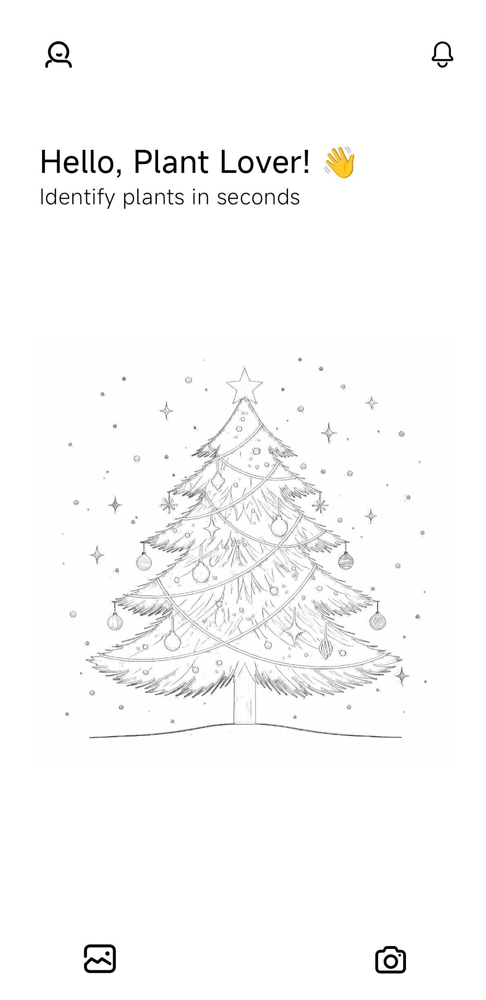
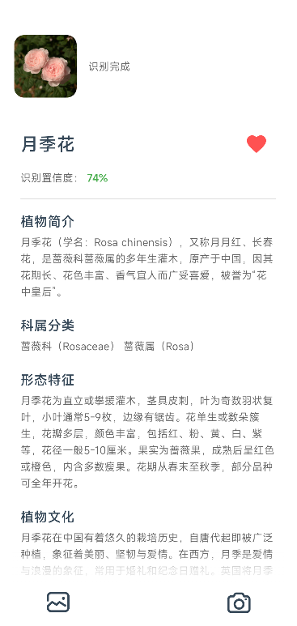
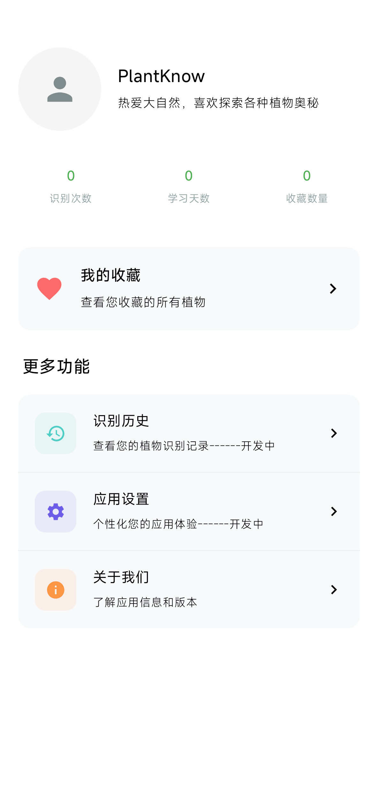

# PlantKnow

   

  

> 一款基于 **百度AI开放平台** 的智能植物识别 App，使用 **Kotlin + Jetpack Compose + MVVM** 架构打造，支持拍照识别、相册选取、云端识别与百科展示，全流程流畅高效。

---

## 🪴 项目简介

**PlantKnow** 是我独立设计与开发的一款基于云端 AI 的植物识别应用。  
它实现了从 **图像采集 → 智能压缩 → 云端识别 → 结果展示** 的完整闭环，识别准确率高达 **97%+**，并在弱网环境下保持极高的响应速度与稳定性。

---

## ✨ 核心功能与亮点

### ☁️ 云端 AI 识别与高性能图像处理
- 接入 **百度AI植物识别API**，实现云端智能识别。
- 支持 **拍照识别 / 相册选取**。
- 使用 **Bitmap 采样 + 质量分级压缩算法**，图片上传体积减少 **70%+**。
- 全流程支持 **Base64 编码 + Retrofit 网络请求**，识别准确率超 **97%**。

### ⚡ 现代化架构与流畅体验
- 基于 **Jetpack Compose + MVVM + StateFlow** 的响应式架构。
- 使用 **Kotlin 协程** 实现全链路异步操作，主线程全程无阻塞。
- 核心识别流程平均耗时 **<800ms**。
- 全局 UI 状态管理：识别中 / 成功 / 失败 / 重试。

### 🧩 系统性优化与兼容性设计
- 全面优化 **内存管理** 与 **OOM防护**，大图加载安全。
- 自适应布局，完美兼容不同屏幕尺寸与 Android 版本。
- 内置 **错误处理机制** 与 **异常恢复策略**。

## 🧰 技术栈

| 模块 | 技术 |
|------|------|
| **语言** | Kotlin |
| **架构** | MVVM + Clean Architecture |
| **UI框架** | Jetpack Compose + Material3 |
| **异步编程** | Kotlin Coroutines + StateFlow |
| **网络请求** | Retrofit + Gson |
| **图片加载** | Coil |
| **AI平台** | 百度AI开放平台 |
| **构建工具** | Gradle + Kotlin DSL |
| **其他** | 模块化架构 / Compose Navigation / 错误状态处理 |

---

## 🖼️ 应用界面预览

| 首页 | 识别结果 | 个人主页 |  
|------|-----------|------------------|
|  |  |  |

---

> 💡 **PlantKnow** 旨在让 AI 识别技术更贴近生活，让自然知识触手可及。

