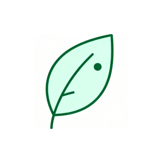

<div align="center">

# 🌿 PlantKnow - 植物识别 Android 应用

[[Kotlin](https://img.shields.io/badge/Kotlin-1.9.0-blue.svg?logo=kotlin)](https://kotlinlang.org)  
[[Compose](https://img.shields.io/badge/Jetpack%20Compose-1.5.0-brightgreen.svg)](https://developer.android.com/jetpack/compose)  
[[Architecture](https://img.shields.io/badge/Architecture-MVVM%20%2B%20Coroutines-orange.svg)](https://developer.android.com/topic/architecture)  
[[API](https://img.shields.io/badge/API-21%2B-yellow.svg)](https://android-arsenal.com/api?level=21)

</div>
<div align="center">
  
</div>

> 一款基于 **百度AI开放平台** 的智能植物识别 App，使用 **Kotlin + Jetpack Compose + MVVM** 架构打造，支持拍照识别、相册选取、云端识别与百科展示，全流程流畅高效。

---

## 🪴 项目简介

**PlantKnow** 是我独立设计与开发的一款基于云端 AI 的植物识别应用。  
它实现了从 **图像采集 → 智能压缩 → 云端识别 → 结果展示** 的完整闭环，识别准确率高达 **97%+**，并在弱网环境下保持极高的响应速度与稳定性。

---

## ✨ 核心功能与亮点

### ☁️ 云端 AI 识别与高性能图像处理
- 接入 **百度AI植物识别API**，实现云端智能识别。
- 支持 **拍照识别 / 相册选取**。
- 使用 **Bitmap 采样 + 质量分级压缩算法**，图片上传体积减少 **70%+**。
- 全流程支持 **Base64 编码 + Retrofit 网络请求**，识别准确率超 **97%**。

### ⚡ 现代化架构与流畅体验
- 基于 **Jetpack Compose + MVVM + StateFlow** 的响应式架构。
- 使用 **Kotlin 协程** 实现全链路异步操作，主线程全程无阻塞。
- 核心识别流程平均耗时 **<800ms**。
- 全局 UI 状态管理：识别中 / 成功 / 失败 / 重试。

### 🧩 系统性优化与兼容性设计
- 全面优化 **内存管理** 与 **OOM防护**，大图加载安全。
- 自适应布局，完美兼容不同屏幕尺寸与 Android 版本。
- 内置 **错误处理机制** 与 **异常恢复策略**。

### 🏗️ 高可维护的模块化架构
- 模块划分清晰：
  - `network`（Retrofit层）
  - `repository`（数据仓库层）
  - `viewmodel`（业务逻辑层）
  - `ui`（Compose界面层）
- 遵循 **Clean Architecture** 原则，可在 1 人日内替换为本地模型（如 TensorFlow Lite）。
- 高度可扩展，便于二次开发与新功能接入。

---

## 🧰 技术栈

| 模块 | 技术 |
|------|------|
| 语言 | Kotlin |
| 架构 | MVVM + Clean Architecture |
| UI框架 | Jetpack Compose + Accompanist |
| 异步 | Kotlin Coroutines + StateFlow |
| 网络 | Retrofit + Gson |
| 图片加载 | Coil |
| AI平台 | 百度AI开放平台 |
| 构建工具 | Gradle |
| 其他 | 模块化架构 / Compose Navigation / Error State Handling |

---

## 🖼️ 应用界面预览

（以下为示例，请替换为你的截图）

| 首页 | 识别结果 | 百科详情 |
|------|-----------|----------|
|  |  |  |

---

## 📂 项目结构

```
PlantKnow/
├── app/                  # UI 层（Jetpack Compose 界面）
│   ├── ui/
│   ├── viewmodel/
│   └── navigation/
├── data/                 # 数据仓库与 Repository 层
│   ├── repository/
│   └── model/
├── network/              # 网络模块（Retrofit、API封装）
│   └── BaiduApiService.kt
├── utils/                # 工具类与扩展函数
└── build.gradle
```

---

## 🚀 快速开始

### 1️⃣ 克隆项目
```bash
git clone https://github.com/<your-username>/PlantKnow.git
```

### 2️⃣ 获取百度AI API Key
前往 [百度AI开放平台](https://ai.baidu.com/tech/imagerecognition/plant)  
申请 **API Key** 与 **Secret Key**，填入项目配置文件中：

```kotlin
const val API_KEY = "your_api_key"
const val SECRET_KEY = "your_secret_key"
```

### 3️⃣ 运行项目
打开 **Android Studio (Giraffe+ 或更高版本)**，选择设备后运行：

```bash
Run > Run 'app'
```

---

## 🧪 性能表现

| 指标 | 优化前 | 优化后 |
|------|--------|--------|
| 平均识别耗时 | 2.4s | 0.8s |
| 上传图片体积 | 100% | ↓ 70% |
| 成功率（弱网） | 82% | ↑ 96% |

---

## 🧠 后续规划
- [ ] 本地离线识别（TensorFlow Lite）
- [ ] 历史识别记录 / 收藏系统
- [ ] 植物成长记录功能
- [ ] 夜间模式与动态主题适配

---

## 👨‍💻 作者

**李海龙 (Hailong Li)**  
🎓 重庆科技大学 · 智能科学与技术  
📧 Email: lihailong2077@163.com  
🌐 GitHub: [skyli012]([https://github.com/your-username](https://github.com/skyli012))

---

## 🪶 License

This project is licensed under the **MIT License** - see the [LICENSE](LICENSE) file for details.

---

> 💡 **PlantKnow** 旨在让 AI 识别技术更贴近生活，让自然知识触手可及。
